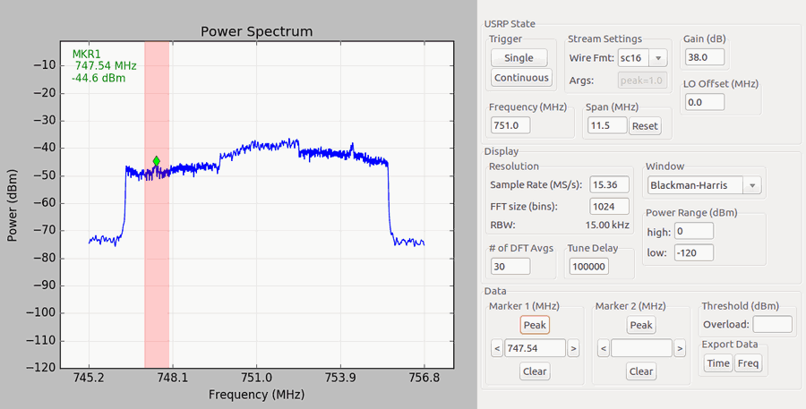

Gr-Analyzer
===========

GR-Analyzer provides a spectrum analyzer-like graphical interface to
the USRP. It is build on
[GNURadio](http://gnuradio.org/redmine/projects/gnuradio/wiki) and
[SciPy](http://www.scipy.org/).



Key Features
------------

* Spectrum sweep capability
* Marker with global peak search
* Peak search in selected region (demo'd in screenshot)
* Output to log if user-selected threshold is exceeded
* Export raw and post-FFT I/Q data to file

Quick Start
-----------
```
# On Ubuntu 16.04 - modify as needed for other systems
$ sudo apt install gnuradio-dev libuhd-dev
$ pip install numpy matplotlib
$ git clone https://github.com/NTIA/gr-analyzer
$ cd gr-analyzer/gr-analyzer
$ mkdir build; cd build
$ sudo make install
$ cd ..
$ ./gr_analyzer.py --help
linux; GNU C++ version 5.3.1 20151219; Boost_105800; UHD_003.009.002-0-unknown

usage: gr_analyzer.py [options] center_freq

Examples:
  gr_analyzer.py 700M --continuous
  gr_analyzer.py 700M --span 100M
  gr_analyzer.py 700M --wire-format=sc8 --args='peak=0.1' --sample-rate 30.72M

positional arguments:
  center_freq

optional arguments:
  -h, --help            show this help message and exit
  --scale SCALE         voltage scale factor applied to IQ samples
  -S SPAN, --span SPAN  width to scan around center_freq [default=sample-rate]
  -d DEVICE_ADDR, --device-addr DEVICE_ADDR
                        UHD device address [default=]
  --wire-format {sc8,sc16}
                        Set wire format from USRP [default=sc16]
  --stream-args STREAM_ARGS
                        Set additional stream args [default=peak=1.0]
  --spec SUBDEV_SPEC    Subdevice of UHD device where appropriate
  -A ANTENNA, --antenna ANTENNA
                        select Rx Antenna where appropriate
  -s SAMPLE_RATE, --sample-rate SAMPLE_RATE
                        set sample rate [default=10000000.0]
  -g GAIN, --gain GAIN  set gain in dB
  --skip-initial samples
                        samples to skip after initiating flowgraph [default=1000000]
  --tune-delay samples  samples to skip after each retune [default=100000]
  --averages fft frames
                        number of DFTs to average at a given frequency [default=30]
  -l Hz, --lo-offset Hz
                        lo_offset in Hz [default=0]
  -o %, --overlap %     Overlap the outer n% of the fft[default=25]
  -F FFT_SIZE, --fft-size FFT_SIZE
                        specify number of FFT bins[default=1024]
  -c, --continuous      Start in continuous run mode[default=False]
  --realtime            Attempt to enable realtime scheduling
```

Support
-------
Douglas Anderson | NTIA/Institute for Telecommunication Sciences | danderson@bldrdoc.its.gov

Legal
-----
Copyright NTIA/Institute for Telecommunication Sciences. Released under GPL 3 - see [LICENSE](LICENSE.txt).
